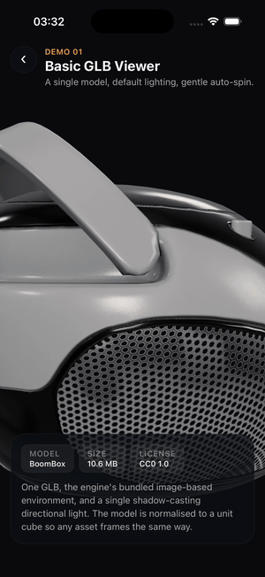
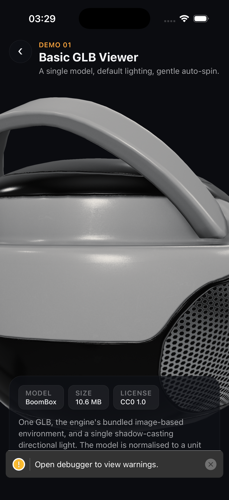
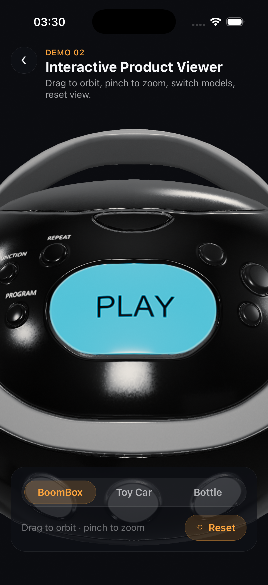
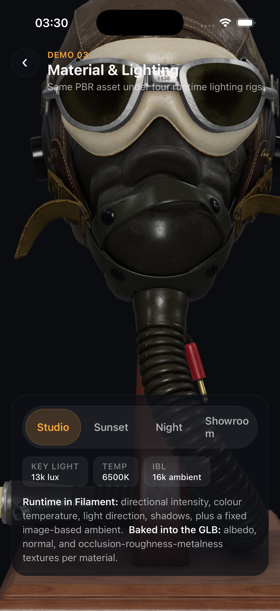
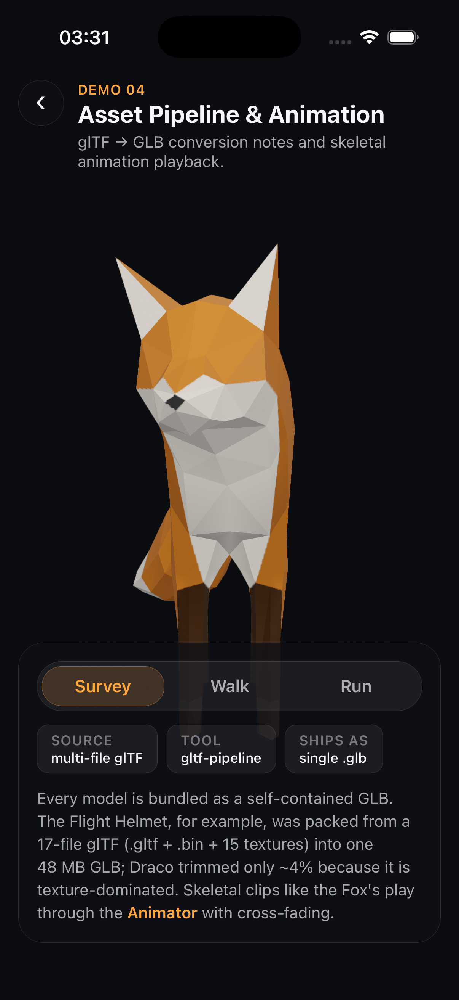

# 🔦 Filament Demo Lab

A small but polished **React Native + [Google Filament](https://github.com/google/filament)** project: four mobile‑native 3D rendering demos, plus an [Astro](https://astro.build) showcase website deployed to Netlify.

The mobile app uses [`react-native-filament`](https://github.com/margelo/react-native-filament) (Margelo's binding to Filament's native engine) to load `.glb` models and render them with PBR materials, image‑based lighting, gesture‑driven cameras, and skeletal animation — drawn on the GPU through **Metal** on iOS.

### ▶ [**Live showcase site →**](https://filament-demo-lab.netlify.app)

<p align="center">
  
</p>

> [!NOTE]
> Filament rendering is **mobile‑native** — it runs on the device's GPU, not in a browser. The website is a *showcase* (screenshots, video, write‑ups, links), not the runtime. See [Why this is mobile‑native](#-why-this-is-mobile-native).

---

## 📸 The demos

|   | Demo | What it shows |
|---|------|---------------|
|  | **1 · Basic GLB Viewer** | The simplest clean scene — one model, default image‑based lighting + a shadow‑casting key light, gentle auto‑spin. |
|  | **2 · Interactive Product Viewer** | Drag to orbit, pinch to zoom, switch between three products, reset the view. Polished React Native overlay controls. |
|  | **3 · Material & Lighting** | One high‑fidelity PBR asset (Flight Helmet) under four runtime lighting rigs — making clear what's controlled live vs. baked into the GLB. |
|  | **4 · Asset Pipeline & Animation** | Skeletal animation playback (Fox: Survey / Walk / Run) plus the real glTF → GLB pipeline used to prepare every asset. |

---

## 🗂️ Repository structure

```txt
filament-demo-lab/
├── mobile/                 # React Native Filament app (the actual demos)
│   ├── App.tsx             # State router: home menu + 4 demo screens
│   ├── src/
│   │   ├── screens/        # One file per demo
│   │   ├── components/     # Lighting, orbit controls, auto-rotation, UI kit
│   │   ├── assets.ts       # require()'d .glb model registry
│   │   └── data/demos.ts   # Demo metadata
│   └── assets/models/      # Bundled CC0 / clearly-licensed .glb files
├── site/                   # Astro showcase website (deployed to Netlify)
│   ├── src/pages/index.astro
│   └── public/media/       # Screenshots + the spinning-model video
├── assets/
│   ├── showcase/           # Full-res screenshots, screen recordings, GIF
│   └── model-notes.md      # Per-model source + license documentation
├── netlify.toml            # Netlify build config (publishes site/dist)
└── README.md
```

---

## 🚀 Quick start

### Mobile app (iOS Simulator)

Requires **macOS + Xcode + CocoaPods + Node**.

```bash
cd mobile
npm install
cd ios && pod install && cd ..   # installs CocoaPods dependencies
npm run ios                       # builds + launches on the iOS Simulator
```

> Android is not configured in this project, but `react-native-filament` supports it (Vulkan/OpenGL).

### Showcase website

```bash
cd site
npm install
npm run dev      # local dev server
npm run build    # static build → site/dist/
npm run preview  # preview the production build
```

---

## 🧰 Tech stack

| Tech | Notes |
|---|---|
| React Native | New Architecture (Fabric); prebuilt React Native Core on iOS |
| react-native-filament | Google Filament binding (Metal on iOS) |
| react-native-worklets-core | Required by Filament for its render thread |
| react-native-gesture-handler | Orbit / pinch camera controls |
| React | UI layer |
| TypeScript | |
| Astro | Static showcase site |

Pinned versions live in [`mobile/package.json`](mobile/package.json) and [`site/package.json`](site/package.json).

---

## 🛰️ Why this is mobile‑native

```txt
Open-source / CC0 3D assets
  ↓  optional cleanup / conversion (glTF → GLB)
GLB files
  ↓  Metro asset bundling
React Native app  ──►  react-native-filament  ──►  Native Filament renderer (Metal)  ──►  iOS GPU

Astro website (this repo's /site)
  ↓  git push
Netlify CDN  ──►  screenshots · video · write-ups · repo links
```

`react-native-filament` wraps Filament's **native C++ engine**. On iOS the renderer talks to **Metal** directly; there is no WebGL and no `<canvas>`. That is why the demos run on a simulator or device and the website only *documents* them. React Native overlays are positioned **on top of** `FilamentView`, never rendered inside it.

---

## 🎨 Three.js / Blender / Godot → Filament

The API names are new, but every concept transfers from prior 3D work:

| Concept | Three.js / prior tools | react-native-filament |
|---|---|---|
| Scene graph | `THREE.Scene` of `Object3D` | Filament `Scene`; `<Model>` adds a glTF entity tree |
| Camera | `PerspectiveCamera(fov, …)` | `<Camera>` with focal length (mm) + near/far |
| Orbit controls | `OrbitControls` | `useCameraManipulator` + gesture-handler |
| Lights | `DirectionalLight`, `PointLight` | `<Light type="directional \| point \| spot">` (lux / lumen) |
| Environment / IBL | `PMREMGenerator` + `scene.environment` | `<EnvironmentalLight source={.ktx}>` (HDR pre-baked to KTX) |
| PBR materials | `MeshStandardMaterial` | Same metal-rough model, authored into the GLB |
| glTF loading | `GLTFLoader().load()` | `<Model source={require('.glb')}>` |
| Animation | `AnimationMixer` + clips | `<Animator animationIndex>` with cross-fade |
| Render loop | `requestAnimationFrame` | Filament Choreographer; `useRenderCallback` worklets |

The biggest *mental* shift is that per‑frame work (camera updates, rotation) runs as **worklets on Filament's render thread** via `react-native-worklets-core`, rather than on the JS thread.

---

## 🧱 Asset sources & licensing

All models come from the [Khronos glTF Sample Assets](https://github.com/KhronosGroup/glTF-Sample-Assets) project. Full per‑model details are in **[`assets/model-notes.md`](assets/model-notes.md)**.

| Model | Author | License | Attribution | Used in |
|---|---|---|---|---|
| BoomBox | Microsoft | CC0 1.0 | Not required | Demos 1 & 2 |
| Toy Car | G. Odendahl & E. Chadwick | CC0 1.0 | Not required | Demo 2 |
| Water Bottle | Microsoft | CC0 1.0 | Not required | Demo 2 |
| Flight Helmet | Microsoft / Gary Hsu | CC0 1.0 | Not required | Demo 3 |
| Fox | PixelMannen, tomkranis, @AsoboStudio, @scurest | CC0 1.0 + **CC BY 4.0** | **Required** | Demo 4 |

**Fox attribution:** model by PixelMannen (CC0 1.0); rigging & animation by tomkranis (CC BY 4.0); glTF conversion by @AsoboStudio and @scurest (CC BY 4.0). The *Damaged Helmet* sample was deliberately excluded — it carries a CC BY‑**NC** (non‑commercial) component.

### Asset pipeline (glTF → GLB)

Filament loads single‑file `.glb`. Most sample models ship that way already, but the **Flight Helmet** only ships as multi‑file glTF (`.gltf` + `.bin` + 15 textures). It was packed into one GLB with [`gltf-pipeline`](https://github.com/CesiumGS/gltf-pipeline):

```bash
npx gltf-pipeline -i FlightHelmet.gltf -o FlightHelmet.glb        # 48 MB single file
npx gltf-pipeline -i FlightHelmet.gltf -o FlightHelmet-draco.glb -d  # Draco: only ~4% smaller
```

Takeaway: GLB just repackages the same buffers + textures into one container, and **Draco only saved ~4%** here because the asset is texture‑dominated (~45 MB of PNGs that Draco doesn't touch — it compresses mesh geometry, not images).

---

## ☁️ Deployment (Netlify)

The site deploys from this repo with [`netlify.toml`](netlify.toml):

```toml
[build]
  base = "site"
  command = "npm run build"
  publish = "dist"
```

Connect the GitHub repo to Netlify (or `cd site && npx netlify deploy --prod`). Only `/site` is built and published — the mobile app is never part of the web deploy.

**Live site:** **https://filament-demo-lab.netlify.app**

---

## 📄 License

Source code is [MIT](LICENSE). The bundled 3D model assets retain their own licenses (CC0 1.0, and CC BY 4.0 components for the Fox) — see [`assets/model-notes.md`](assets/model-notes.md).
